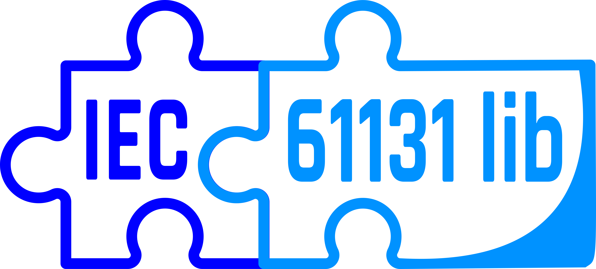

  <h1 align="center">
    
    
IEC 61131-3 library for data types and functions 

  </h1>

## Known bugs (will be corrected after complete libraries)
 - iec_totype function interferes with strings

## Roadmap

### TODO
* [ ] Add comments for Doxygen
* [ ] Complete libraries
   * [x] core
   * [x] arithmetic
   * [x] bit_shift
   * [x] bitwise_boolean
   * [x] comparison
   * [ ] conversion
   * [ ] date_time
   * [x] mathematical
   * [x] selection
   * [ ] string
   * [x] literals
   * [x] standard function blocks
 
* [ ] Complete test
   * [x] core
   * [x] arithmetic
   * [x] bit_shift
   * [x] bitwise_boolean
   * [x] comparison
   * [ ] conversion
   * [ ] date_time
   * [x] mathematical
   * [x] selection
   * [ ] string
   * [x] literals
   * [ ] standard function blocks
   
* [ ] Complete documentation
   * [ ] core
   * [ ] arithmetic
   * [ ] bit_shift
   * [ ] bitwise_boolean
   * [ ] comparison
   * [ ] conversion
   * [ ] date_time
   * [ ] mathematical
   * [ ] selection
   * [ ] string
   * [ ] literals
   * [ ] standard function blocks
